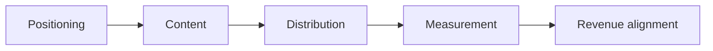

# B2B SaaS LinkedIn — Cross-Author Patterns

**Research synthesis · Strategic playbook inputs**

---

## Why this exists

This note distills **repeatable principles** from the expert briefs in this project—not post recaps, but **what a leadership team would actually operationalize** for organic LinkedIn as part of growth, not as a side-channel social experiment.

---

## The one-line thesis

> **Treat LinkedIn as a layer in your growth system**—positioning, narrative, distribution, and measurement—not as “posting more.”

The strongest operators use the feed to **shape perception**, **earn trust before sales**, **anchor positioning**, **educate buyers**, **support pipeline**, and **reduce friction**—all in one coherent motion.

---

## How the pieces stack

*Positioning first; distribution multiplies asset ROI; measurement asks commercial questions.*

---

## Six patterns — at a glance

| # | Pattern | Who reinforces it | CEO question |
|---|---------|-------------------|----------------|
| 1 | Demand before capture | Walker, Gerhardt, Hormozi | Are we **creating** future buyers, not only harvesting intent? |
| 2 | Distribution > raw creation | Simmonds, Natividad, Flanagan | Is the bottleneck **reach and repetition**, not ideas? |
| 3 | Positioning gates performance | Dunford, Pierri, Gerhardt | Would a buyer repeat **why us vs. alternatives** in one sentence? |
| 4 | Systems beat hero posts | Hormozi, Flanagan, Poyar | Do we have a **repeatable engine**, or sporadic campaigns? |
| 5 | Revenue > vanity | Walker, Hormozi, Poyar | Does this content **improve trust, pipeline quality, or efficiency**? |
| 6 | Trust via clarity + cadence | Welsh, Natividad, Gerhardt, Simmonds | Is our **message** consistent enough to compound? |

---

## Pattern 1 — Content builds demand *before* it captures it

**Signal:** Organic work keeps you **visible and credible** while buyers are not in-market; value often shows up later in conversion, warmth, cycle length, and inbound quality.

**Implication:** Do not judge the program on **short-term attribution alone**. That misprices compounding.

**Takeaway:** Demand creation **compounds**—and reduces over-reliance on paid and brute-force outbound.
---

## Pattern 2 — Distribution is the multiplier

**Signal:** The constraint is rarely “we need more posts.” It is **weak distribution**, thin repurposing, insufficient **message repetition**, and misalignment with where attention already lives.

**Implication:** Better distribution **lifts every asset** without linear cost increases in production.

**Takeaway:** Distribution turns content from **cost** into **leverage**.
---

## Pattern 3 — Positioning is upstream of every metric

**Signal:** Sharp creative under weak positioning still reads as **generic**. The story must answer *for whom*, *against what*, *why now*.

**Implication:** Low conversion, weak ICP engagement, long cycles, and “we explain too much on every call” often trace back to **narrative**, not channel tactics.

**Takeaway:** **Scale clarity before scale volume.**
---

## Pattern 4 — Growth is a system, not a streak of hits

**Signal:** Durable outcomes come from **repeatable loops**: positioning → creation → distribution → measurement → monetization / expansion— not one-off viral moments.

**Implication:** Random visibility does not compound; **systems** produce learning and predictability.

**Takeaway:** The goal is a **compounding content system**, not more one-off posts.
---

## Pattern 5 — Judge by business impact, not applause

**Signal:** A quieter post that reaches **the right buyers** can outperform a noisy one commercially.

**Implication:** Teams optimized purely for engagement may win the feed and **lose the funnel**.

**Takeaway:** Ask: *Did this improve **trust, demand, pipeline quality, or growth efficiency**?*—not only *Did it pop in the algorithm?*
---

## Pattern 6 — Trust is repetition of a clear point of view

**Signal:** Authority comes from **consistent**, **high-signal** ideas over time—not from a single spike.

**Implication:** Mental availability in-market rises when **message and rhythm** stay steady.

**Takeaway:** **Clarity + cadence** compound trust.
---

## Operating model — five layers

When the patterns above align, LinkedIn stops looking like “social” and starts looking like **integrated GTM narrative work**:

1. **Positioning** — ICP, problem, differentiation, competitive frame  
2. **Content** — practical, opinionated, education-led, on-brand POV  
3. **Distribution** — native formats, repurposing, deliberate repetition, zero-click thinking where it fits  
4. **Measurement** — inbound quality, influenced pipeline, sales efficiency—not only engagement  
5. **Monetization fit** — alignment with product value, packaging, and expansion logic  

---

## Draft playbook — leadership checklist

1. **Lead with positioning** — No volume push until *who / why us / what we own* is crisp.  
2. **Publish for trust** — Optimize for **credibility with the right audience**, not generic reach.  
3. **Systematize distribution** — Native post → derivatives → **reinforcement over weeks**, not one-and-done.  
4. **Tie content to revenue** — Educate, remove confusion, shorten and **elevate** sales conversations.  
5. **Measure commercially** — Resonance with ICP, message clarity, pipeline quality, qualitative “this content showed up in the deal.”  

---

## Closing — for the CEO

LinkedIn organic, done well, is **not** a brand vanity play. It is **strategic capital** when positioning is sharp, distribution is intentional, narrative is steady, and success is tied to **commercial outcomes**.

**The winners are not the loudest posters.** They are the teams that turn content into a **compounding system** for trust, demand, and efficient growth.

---

*Synthesis of expert briefs in `research/linkedin-posts/` — use alongside individual author files for depth and examples.*
