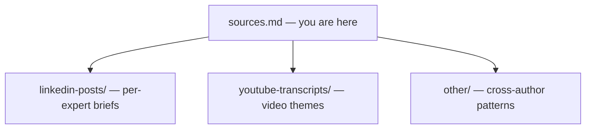

# LinkedIn Organic Content — B2B SaaS Research Map

**Curated operator intelligence · Demand, narrative, and pipeline**

---

## Executive thesis

> **Organic LinkedIn is not a “social” line item—it is a compounding layer of demand, trust, and narrative when it sits inside positioning, distribution, and commercial measurement.**

This research pack turns **how top operators actually behave in public** into **patterns** a leadership team can stress-test against their own GTM—not academic theory.

---

## Leadership snapshot

- **What this is:** Analysis of **top B2B SaaS operators** and their **patterns** on LinkedIn (plus supporting video notes) for **demand, brand, and commercial efficiency**.
- **What it’s for:** Aligning **organic content** with **positioning**, **distribution**, and **business outcomes**—not reach metrics alone.
- **How to use it:** Read **`content-patterns.md`** as the synthesis; go deeper per expert in **`linkedin-posts/`** and **`youtube-transcripts/`**.

---

## 📌 At a glance

| | |
|---|---|
| **Scope** | ~**10** high-signal B2B SaaS / GTM voices |
| **Artifacts** | LinkedIn post briefs, YouTube theme notes, cross-author synthesis |
| **Output** | Repeatable **patterns**, not a generic “post more” checklist |
| **Bias** | **Real-world growth thinking**—what ships in public and scales in market |

---

## What this project includes

- **Operator research** — Profiles and posts chosen for **demand gen, positioning, distribution, and systems thinking**
- **LinkedIn intelligence** — Per-author briefs with **strategic interpretation** and verified public links where captured
- **Pattern synthesis** — `other/content-patterns.md`: **six** recurring themes + **playbook** hooks for leadership
- **Video layer** — YouTube notes (e.g. Walker, Hormozi) framing **content as demand / capital**

---

## Objective

To clarify how **LinkedIn organic** can function as a **scalable** channel for **acquisition and demand** in B2B SaaS: **creation + distribution + narrative + measurement**—with **pipeline quality** and **sales efficiency** in view, not vanity alone.

---

## 🗂️ Repository structure

| Path | Purpose |
|------|---------|
| `research/sources.md` | **Selection context** and map of the research corpus |
| `research/linkedin-posts/` | **Collected content** and executive-style analysis |
| `research/youtube-transcripts/` | **Long-form** arguments (demand, content systems) |
| `research/other/` | **Synthesis** — e.g. `content-patterns.md` |

---

## 🎯 Strategic focus

- **Demand generation** — Create and shape preference, not only capture forms  
- **Content strategy** — Goals, leverage, and **compounding** over time  
- **Founder / executive voice in B2B** — Trust **before** the sales conversation  
- **Pipeline & efficiency** — What **sales** and **revops** should feel downstream  

---

## Where to start (60 seconds)

1. Open **`research/other/content-patterns.md`** for the **cross-expert** executive view.  
2. Pick **one** author in **`research/linkedin-posts/`** closest to your current gap (e.g. positioning vs. distribution).  
3. Reconcile **public narrative** with **internal pitch**—same test April Dunford / Anthony Pierri stacks imply.

---

## LinkedIn post links (`linkedin-posts/`)

- **Format:** `https://www.linkedin.com/posts/{memberSlug}_{descriptive-slug}-activity-{activityId}-{suffix}` (canonical public permalinks).
- **Verification:** Each post URL in this corpus was checked (March 2026) and returned a **public** post page for the correct author. LinkedIn may later require sign-in for some regions or A/B tests—re-spot-check before a board or client readout.

---

*Built for **decisions**, not slides for their own sake. File paths match the repo and deep-link cleanly from the [README](../README.md).*
