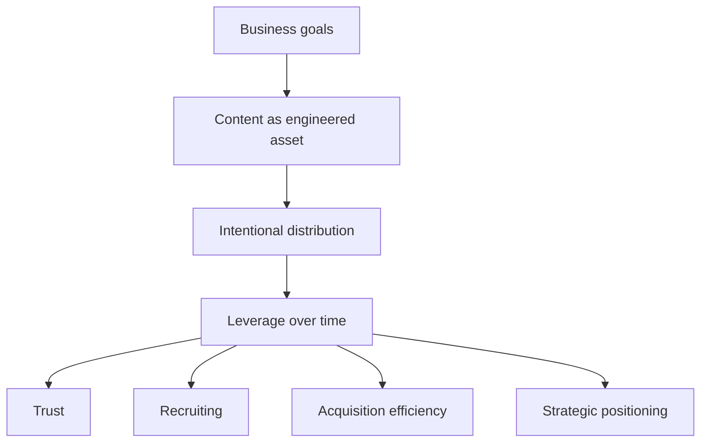

# Alex Hormozi — Content Strategy & Business Growth (YouTube) · Executive Brief

**Expert:** Alex Hormozi · **Topic:** Content as a business system, leverage, distribution, growth

---

## Source

| Field | Detail |
|--------|--------|
| **Title** | Content Strategy and Business Growth |
| **Channel** | YouTube |
| **Use in this project** | Frames **content as capital**—goals, distribution, and **compounding leverage** across trust, hiring, acquisition, and positioning |

*Paste the canonical video URL here when you lock the asset.*

---

## CEO thesis (one line)

> **Content is an asset class: it only compounds when goals are explicit, distribution is deliberate, and attention is converted into trust and commercial leverage—not when it is treated as a creative hobby.**

---

## What the video is arguing

*Creation without **goals + distribution** burns effort; **systems** turn output into **multiplier effects**.*

---

## Strategic ideas — distilled

1. **Tie content to measurable business outcomes** — Not “post more,” but **which metric** (trust, pipeline support, employer brand, conversion efficiency, narrative ownership) each motion serves.
2. **Design for compounding** — The payoff is **cumulative**: archives, reputation, and message reinforcement—not only single-post spikes.
3. **Distribution is half the product** — High-quality ideas without **reach and repetition** underperform; **channel choice** is strategic, not administrative.
4. **Allocate attention like capital** — **Double down** where attention is **high quality** (right people, right context) and **maps to outcomes**; starve channels that confuse activity with impact.
5. **Cross-functional leverage** — Strong narrative and proof **simultaneously** support **sales**, **hiring**, and **market positioning**—one system, several balance-sheet effects.

---

## Why leadership should care

| Lens | Implication |
|------|-------------|
| **Capital allocation** | Content budgets should be judged like **any investment**: expected **leverage**, payback horizon, and **opportunity cost** of misfired channels. |
| **Operating model** | Without **goals + distribution rules**, teams default to **volume** and **vanity**—exactly what Hormozi’s frame is meant to prevent. |
| **Compounding** | **Consistency under a clear thesis** beats episodic campaigns; the org learns faster when output is **stacked**, not reset every quarter. |

---

## Link to this project (LinkedIn stack)

This brief **reinforces** the cross-author patterns in `research/other/content-patterns.md`: **systems over tactics**, **distribution as multiplier**, and **revenue / leverage over raw engagement**. It pairs naturally with the Hormozi LinkedIn brief in `research/linkedin-posts/alex-hormozi.md`.

**In one sentence for a board deck:** *We are building a **goal-backed content system** with **deliberate distribution** so that narrative work **compounds** into trust, hiring, and **efficient acquisition**—not disconnected social output.*

---

## Executive takeaway

- **Manage content strategy like capital:** clear goals, explicit channel thesis, and **kill / scale** decisions based on **quality of attention** and **business outcomes**.
- **Require distribution design** alongside creation—otherwise you are funding **inventory**, not **leverage**.
- **Measure compounding**, not only campaign peaks: reputation, message pull-through, and **downstream efficiency** (sales, recruiting, conversion).

---

*Notes derived from this video’s themes as captured in project research—not a verbatim transcript. Add timestamps and quotes when you attach the full transcript file.*
