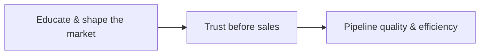

# Chris Walker — Demand Generation (YouTube) · Executive Brief

**Expert:** Chris Walker · **Topic:** B2B SaaS demand generation, pipeline, content-led growth

---

## Source

| Field | Detail |
|--------|--------|
| **Title** | Demand Generation for B2B SaaS |
| **Channel** | YouTube |
| **Use in this project** | Grounds **LinkedIn organic** as a **demand-creation** lever—not a vanity or “lead form” channel |

*Paste the canonical video URL here when you lock the asset.*

---

## CEO thesis (one line)

> **Growth compounds when you create demand and buyer readiness—not when you only harvest intent and count forms.**

---

## What the video is arguing

*The through-line: **belief and education upstream** → **less friction downstream**.*

---

## Strategic ideas — distilled

1. **Demand generation ≠ lead collection** — The job is **future pipeline** and **readiness**, not maximizing MQL volume from people who were already shopping.
2. **Buyers self-edserve first** — A large share of evaluation happens **before** any form fill; if you only measure the form, you **misread** what actually influenced the deal.
3. **Content is a trust and friction lever** — Strong narrative and teaching **de-risk** the eventual conversation; sales stops paying the full “explain everything” tax.
4. **Attribution will under-credit the work** — Last-touch and form-centric models **systematically undervalue** long-horizon, multi-touch influence—especially in B2B SaaS.
5. **Judge content commercially** — The right tests are **pipeline quality**, **buyer readiness**, **cycle dynamics**, and **sales efficiency**—not engagement or leads alone.

---

## Why leadership should care

| Lens | Implication |
|------|-------------|
| **Capital allocation** | Over-investing in “capture” without **creation** trains the org to optimize for **cheap signals**, not **revenue gravity**. |
| **Sales efficiency** | Better **pre-call belief** shortens explanation, improves discovery quality, and raises win probability where you are truly differentiated. |
| **Measurement** | If dashboards only reward **direct response**, you will **cut** the very activities that make **next quarter’s** pipeline sane. |

---

## Link to this project (LinkedIn stack)

Chris Walker’s frame **directly supports** the cross-author pattern: **organic LinkedIn as part of a growth system**—aligned with **demand before capture**, **revenue over vanity**, and **systems over random posts** (see `research/other/content-patterns.md` and the Walker brief in `research/linkedin-posts/chris-walker.md`).

**In one sentence for a board deck:** *We are building **belief and preference in-market** so that when intent appears, we are already **trusted**—not restarting from zero on the first call.*

---

## Executive takeaway

- **Optimize for buyer readiness and pipeline quality**, not proxy metrics that reward only the last click or the form submit.
- **Expect attribution to lag the truth**; pair analytics with **qualitative** sales feedback and **cohort-level** pipeline views.
- **Treat content (including LinkedIn) as demand infrastructure**—the same strategic line as **category narrative**, **education**, and **trust**, not as a sidecar “social” workstream.

---

*Notes derived from this video’s themes as captured in project research—not a verbatim transcript. Add timestamps and quotes when you attach the full transcript file.*
